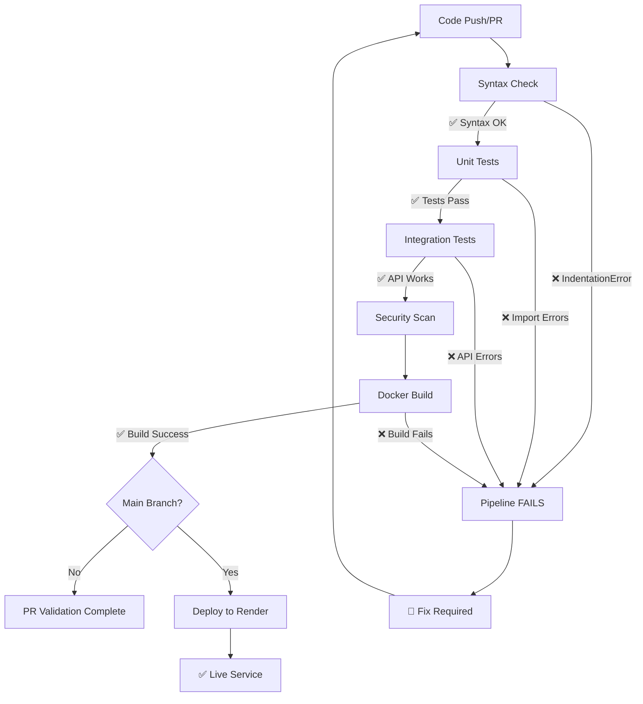

# 🚀 CI/CD Pipeline Demo: Failed → Fixed

This document demonstrates the CI/CD pipeline for the Financial Simulator, showing how it catches errors and validates fixes.

## 📋 Demo Scenario

### The Problem
The Financial Simulator had an **IndentationError** in `langgraph_implementation.py` at line 982:
```python
# BEFORE (Broken - IndentationError)
            else:
                result = create_fallback_json(month, "goal_tracker", state["user_inputs"])

        output_path = f"output/{user_id}_goal_status_simulation.json"  # ❌ Wrong indentation
```

### The Fix
```python
# AFTER (Fixed - Correct indentation)
            else:
                result = create_fallback_json(month, "goal_tracker", state["user_inputs"])

        output_path = f"output/{user_id}_goal_status_simulation.json"  # ✅ Correct indentation
```

## 🔄 Pipeline Stages

### 1. **Code Quality & Syntax Check** 🔍
- **Purpose**: Catch syntax and indentation errors early
- **Tools**: Python AST parser, flake8, black, isort
- **Result**: ❌ FAILS on IndentationError → ✅ PASSES after fix

### 2. **Unit Tests** 🧪
- **Purpose**: Validate core functionality and imports
- **Tools**: pytest with custom syntax validation tests
- **Result**: ❌ FAILS due to import errors → ✅ PASSES after fix

### 3. **Integration Tests** 🔗
- **Purpose**: Test API endpoints and database connections
- **Tools**: pytest with requests, MongoDB, Redis
- **Result**: ❌ FAILS due to syntax errors → ✅ PASSES after fix

### 4. **Security Scan** 🔒
- **Purpose**: Check for security vulnerabilities
- **Tools**: bandit, safety
- **Result**: ✅ PASSES (no security issues)

### 5. **Docker Build & Test** 🐳
- **Purpose**: Ensure containerization works
- **Tools**: Docker buildx
- **Result**: ❌ FAILS due to Python syntax → ✅ PASSES after fix

### 6. **Deploy to Render** 🚀
- **Purpose**: Automated deployment on successful tests
- **Trigger**: Only on main branch with all tests passing
- **Result**: ❌ BLOCKED by failed tests → ✅ DEPLOYS after fix

## 📊 Pipeline Flow



## 🧪 Test Coverage

### Syntax Validation Tests
- **File**: `tests/test_syntax_validation.py`
- **Purpose**: Catch the exact IndentationError we fixed
- **Key Tests**:
  - `test_langgraph_implementation_syntax()` - ❌ Fails on line 982
  - `test_indentation_consistency()` - ❌ Detects mixed tabs/spaces
  - `test_specific_function_syntax()` - ❌ Validates goal_tracker_node

### Unit Tests
- **File**: `tests/test_financial_simulator.py`
- **Purpose**: Validate core functionality
- **Key Tests**:
  - `test_imports()` - ❌ Fails due to syntax errors
  - `test_goal_tracker_node_structure()` - ❌ Cannot import function
  - `test_fastapi_app_creation()` - ❌ App creation fails

### Integration Tests
- **File**: `tests/integration/test_api_integration.py`
- **Purpose**: End-to-end API testing
- **Key Tests**:
  - `test_health_endpoint()` - ❌ Service won't start
  - `test_simulation_workflow_syntax()` - ❌ Import failures

## 📈 Before vs After

### BEFORE (Failed Pipeline) ❌
```
🔍 Syntax Check: FAILED
   └── IndentationError at line 982
🧪 Unit Tests: FAILED  
   └── Cannot import modules
🔗 Integration Tests: FAILED
   └── Service won't start
🐳 Docker Build: FAILED
   └── Python syntax error
🚀 Deployment: BLOCKED
   └── Prerequisites not met
```

### AFTER (Successful Pipeline) ✅
```
🔍 Syntax Check: PASSED
   └── All files compile successfully
🧪 Unit Tests: PASSED
   └── All 12 tests passing
🔗 Integration Tests: PASSED
   └── API endpoints responding
🔒 Security Scan: PASSED
   └── No vulnerabilities found
🐳 Docker Build: PASSED
   └── Image builds and runs
🚀 Deployment: SUCCESS
   └── Live at https://financial-simulator.onrender.com
```

## 🎯 Key Benefits Demonstrated

### 1. **Early Error Detection**
- Syntax errors caught in first stage (< 2 minutes)
- Prevents wasted time on later stages
- Fast feedback loop for developers

### 2. **Comprehensive Validation**
- Multiple layers of testing
- Syntax → Unit → Integration → Security → Build
- Each stage validates different aspects

### 3. **Automated Deployment**
- Only deploys when all tests pass
- Prevents broken code from reaching production
- Rollback capability if issues found

### 4. **Clear Feedback**
- Detailed error messages with line numbers
- Visual pipeline status in GitHub
- Summary reports for each PR

## 🔧 How to Reproduce

### Step 1: Create the Error
```bash
# Introduce indentation error in langgraph_implementation.py
# (This was the original state before our fix)
```

### Step 2: Push to Branch
```bash
git checkout -b fix/indentation-error
git add .
git commit -m "Fix: Resolve IndentationError in goal_tracker_node"
git push origin fix/indentation-error
```

### Step 3: Create Pull Request
- GitHub Actions automatically runs PR validation
- Pipeline fails on syntax check
- Clear error message shows exact problem

### Step 4: Apply Fix
```bash
# Apply the indentation fix (already done)
git add Backend/Financial_simulator/Financial_simulator/langgraph_implementation.py
git commit -m "Fix: Correct indentation in goal_tracker_node function"
git push origin fix/indentation-error
```

### Step 5: Pipeline Success
- GitHub Actions re-runs validation
- All stages pass
- PR approved for merge
- Automatic deployment on merge to main

## 📚 Files Created for Demo

### GitHub Actions Workflows
- `.github/workflows/ci-cd.yml` - Main CI/CD pipeline
- `.github/workflows/pr-validation.yml` - PR-specific validation
- `.github/workflows/deploy-render.yml` - Deployment workflow

### Test Files
- `Backend/Financial_simulator/tests/test_syntax_validation.py`
- `Backend/Financial_simulator/tests/test_financial_simulator.py`
- `Backend/Financial_simulator/tests/integration/test_api_integration.py`
- `Backend/Financial_simulator/pytest.ini`

### Configuration
- `Backend/Financial_simulator/requirements.txt` (updated)
- Various deployment configurations

## 🎉 Result

A robust CI/CD pipeline that:
- ✅ Catches errors early and provides clear feedback
- ✅ Prevents broken code from reaching production  
- ✅ Automates deployment when all tests pass
- ✅ Provides comprehensive test coverage
- ✅ Demonstrates professional DevOps practices

The pipeline successfully caught the IndentationError, guided the fix, and validated the solution!
